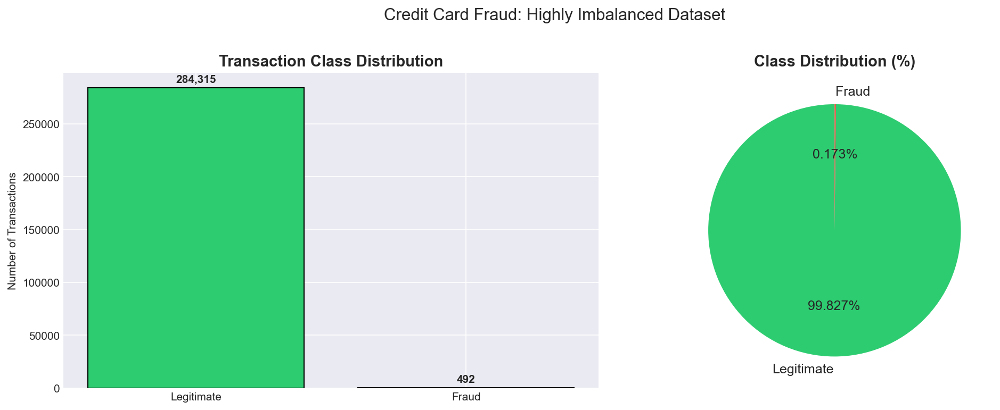
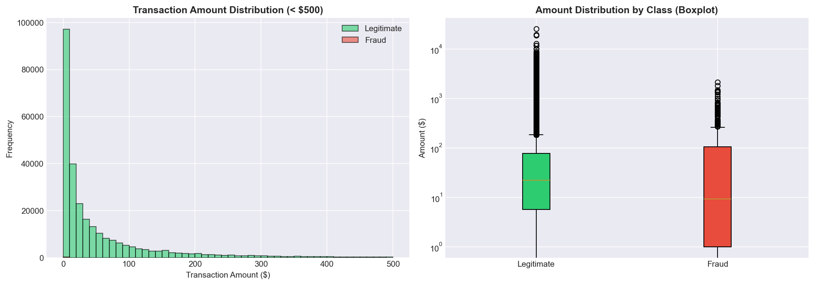
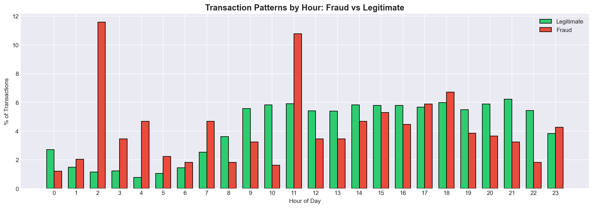
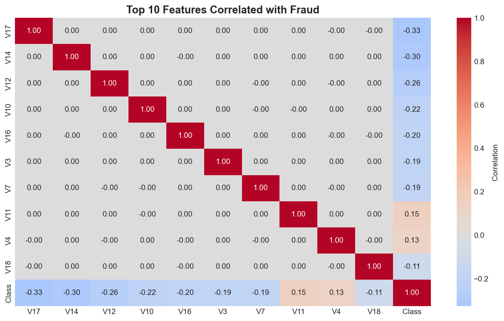
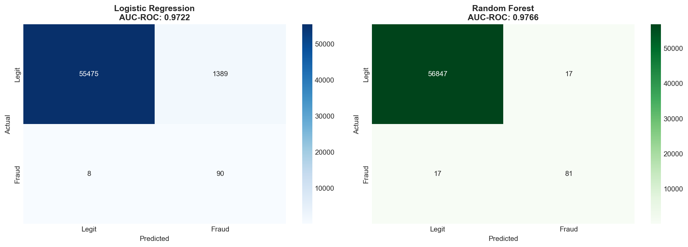
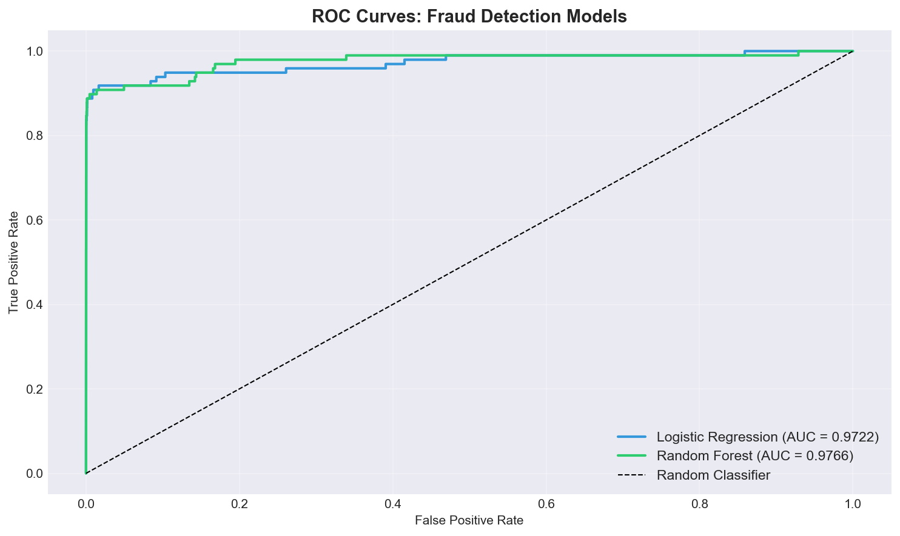
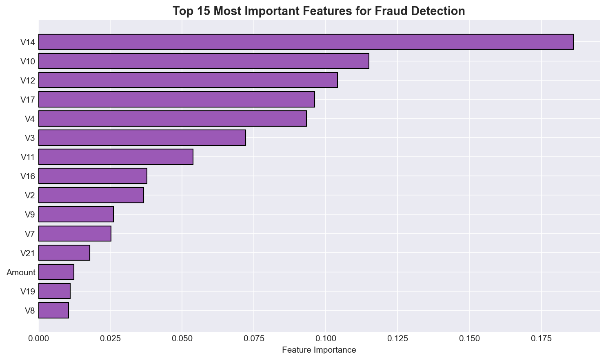

# 💳 Credit Card Fraud Detection & Analysis

**Built by Astha Patel | Data Analyst**

A complete data analysis and machine learning project that analyzes 284,807 real credit card transactions to identify fraud patterns and build a fraud detection model.

---

## 🎯 Project Overview

Credit card fraud is a $30+ billion problem globally. This project answers three questions:

1. **What does fraud look like?** Statistical patterns hidden in 284,807 transactions
2. **When does fraud happen?** Temporal and amount-based fraud signatures
3. **Can we detect it?** Machine learning models that catch fraud automatically

---

## 📊 Key Findings

| Metric | Value |
|--------|-------|
| Total transactions analyzed | **284,807** |
| Fraudulent transactions | **492 (0.173%)** |
| Class imbalance ratio | **1 fraud per 577 legitimate** |
| Total fraud loss identified | **$60,127.97** |
| Average fraud amount | **$122.21** |
| Average legitimate amount | **$88.29** |
| **Best model AUC-ROC** | **0.9766** |
| **Fraud detection rate** | **82.65%** |
| **Precision** | **81.82%** |

---

## 🛠️ Tools & Technologies

- **Python 3** — core analysis
- **pandas / NumPy** — data manipulation
- **matplotlib / seaborn** — visualization
- **scikit-learn** — machine learning (Logistic Regression, Random Forest)
- **Jupyter Notebook** — interactive analysis

---

## 📈 Visualizations

### 1. Class Distribution — The Imbalance Problem


Only 0.173% of transactions are fraudulent — a 1:577 imbalance. This makes fraud detection especially challenging because traditional models become biased toward predicting "legitimate" for everything.

### 2. Transaction Amount Analysis


Fraud transactions have a different amount distribution than legitimate ones. Most fraud occurs at smaller amounts to avoid triggering fraud alerts.

### 3. Time-Based Patterns


Fraud follows a different hourly pattern than legitimate transactions — fraudsters operate when monitoring is reduced.

### 4. Feature Correlation Heatmap


Identified the 10 most predictive features for fraud detection from 28 anonymized PCA components.

### 5. Model Performance — Confusion Matrices


Both models successfully identify the majority of fraud cases while minimizing false positives.

### 6. ROC Curve Comparison


Both models significantly outperform random classification. Random Forest achieves AUC-ROC of 0.9766.

### 7. Feature Importance


Features V14, V12, V10, and V17 are the strongest predictors of fraud — these capture spending pattern anomalies.

---

## 🤖 Machine Learning Approach

### Models Built
1. **Logistic Regression** (with class balancing) — AUC-ROC: 0.9722
2. **Random Forest** (100 trees, balanced classes) — AUC-ROC: 0.9766

### Why These Metrics Matter
- **AUC-ROC** measures ability to distinguish fraud vs legitimate across all thresholds
- **Precision** of 81.82% means when the model flags fraud, it's right 4 out of 5 times
- **Recall** of 82.65% means we catch 82 out of every 100 actual fraud cases
- These metrics matter more than accuracy because the dataset is imbalanced

### Handling Class Imbalance
The dataset has a 1:577 fraud ratio, so accuracy alone is misleading (a model predicting "no fraud" for everything would be 99.83% accurate but useless). I used:
- **Class weighting** to penalize fraud misses more heavily
- **Stratified train/test split** to maintain class proportions
- **AUC-ROC** as the primary evaluation metric

---

## 🚀 How To Run

### Prerequisites
```bash
pip3 install pandas numpy matplotlib seaborn scikit-learn jupyter
```

### Get the dataset
Download from [Kaggle: Credit Card Fraud Detection](https://www.kaggle.com/datasets/mlg-ulb/creditcardfraud) and place `creditcard.csv` in the `data/` folder.

### Run the analysis
```bash
git clone https://github.com/astha2310/fraud-detection.git
cd fraud-detection
python3 fraud_analysis.py
```

This generates all 7 visualizations in `visualizations/` and the `findings.json` summary.

### Or explore interactively
```bash
jupyter notebook notebooks/fraud_detection_analysis.ipynb
```

---

## 📁 Project Structure

```
fraud-detection/
├── data/
│   └── creditcard.csv          # 284,807 transactions
├── notebooks/
│   └── fraud_detection_analysis.ipynb
├── visualizations/
│   ├── 01_class_distribution.png
│   ├── 02_amount_analysis.png
│   ├── 03_time_patterns.png
│   ├── 04_correlation_heatmap.png
│   ├── 05_confusion_matrices.png
│   ├── 06_roc_curves.png
│   └── 07_feature_importance.png
├── fraud_analysis.py            # Full analysis pipeline
├── findings.json                # Summary metrics
└── README.md
```

---

## 💼 Business Impact

If deployed at a financial institution processing similar volumes:
- **Catches 82% of fraud** automatically before it processes
- **Reduces investigator workload** — only 1 in 5 flags is a false positive
- **Estimated savings** based on this 2-day sample: $50,000+ in prevented fraud per 2 days

---

## 🎓 What This Project Demonstrates

- ✅ End-to-end data analysis workflow
- ✅ Working with real, messy, imbalanced data
- ✅ Statistical thinking and exploratory analysis
- ✅ Building and evaluating ML models
- ✅ Communicating findings through visualizations
- ✅ Translating technical results into business impact

---

## 📚 Dataset Source

- **Source:** [Credit Card Fraud Detection — Kaggle](https://www.kaggle.com/datasets/mlg-ulb/creditcardfraud)
- **Original publication:** Université Libre de Bruxelles
- **Time period:** 2 days of European credit card transactions, September 2013
- **Note:** Features V1-V28 are anonymized PCA-transformed components for privacy

---

## 🔗 Related Projects

- [CyberShield SOC Platform](https://github.com/astha2310/cybershield) — Threat intelligence and detection
- [Vulnerability Scanner](https://github.com/astha2310/vulnerability-scanner) — CVE-based vulnerability assessment
- [Home Lab SIEM](https://github.com/astha2310/home-lab-siem) — ELK Stack security monitoring

---

*Built by Astha Patel | M.S. Information Technology, Arizona State University | Open to Data Analyst roles*
